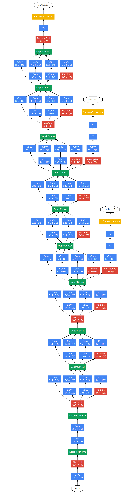
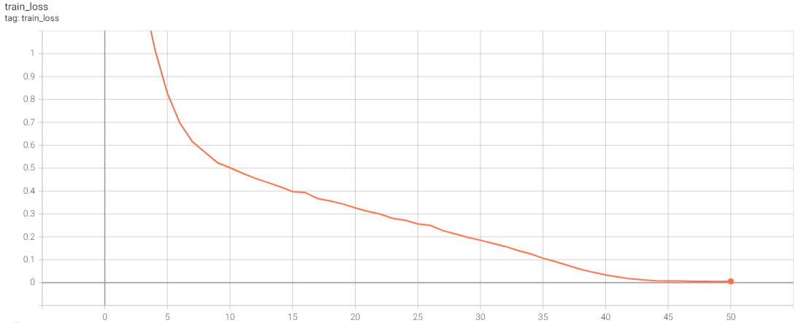
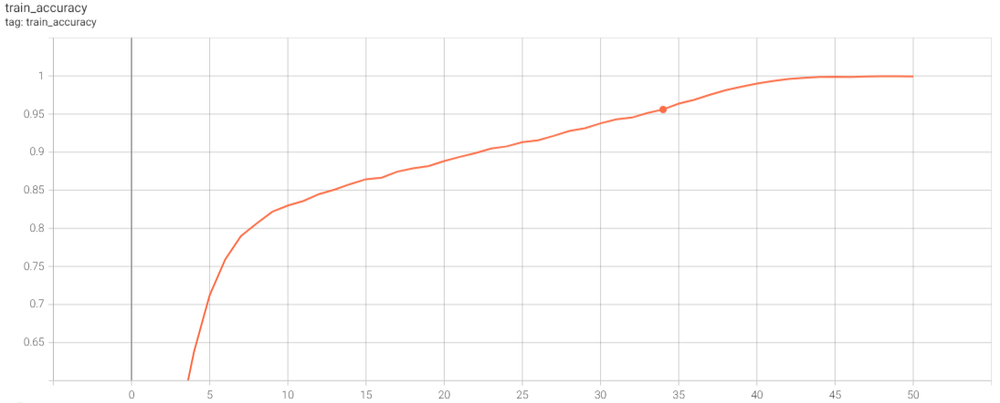
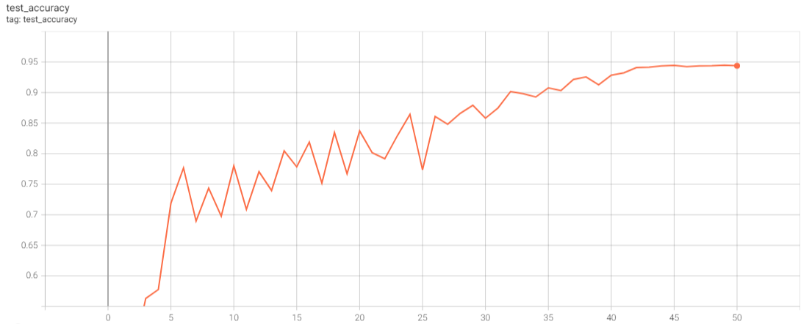

# How to run
    python train.py

# What's This
This is an implementation of GoogLeNet on Cifar10. 

## Introduction
Before GoogLeNet, convolutional neural networks were basically composed of multiple convolutional layers and pooling layers, and then one or more fully connected layers were connected to predict the output. In the convolutional neural network, for the purpose of the convolution layer and pooling layer before the full connection layer, various image features are extracted. In order to adapt to the input of the full connection layer, these image features are drawn into a one-dimensional vector, which usually leads to the network model parameters mainly concentrated in the full connection layer. Therefore, in order to avoid overfitting, dropout is often used at the full-connection layer to reduce the risk of overfitting. 

Meanwhile, the pooling layer can be divided into average pooling layer and maximum pooling layer. The average pooling layer mainly retains the background information of the image, while the maximum pooling layer mainly retains the texture information. The main purpose of the pooling layer is to reduce the features and network parameters. The maximum pooling layer is usually used before the current GoogLeNet. However, the maximum pooling layer may lead to the loss of spatial information and reduce the representation ability of the model. Therefore, in order to solve this problem, Lin et al. put forward Inception -- "Network in Network" in 2013. Inception module mainly adds an additional 1X1 convolution layer to CNN and uses Relu as the activation function. Its main function is to achieve dimension reduction of network features and reduce a large amount of computation without sacrificing the performance of the network model, which can be used to train deeper and wider networks.

## Framework of GoogleNet

# Details about my implementation

* Data augmentation  
Train: Pictures are randomly resized in the range of [256, 512], then 224x224 patches are extracted randomly and are normalized locally. Horizontal flipping is applied with 0.5 probability.  
Test: Pictures are resized to 384x384, then they are normalized locally. Single image test is used to calculate total accuracy. 

* Auxiliary classifiers  
No implementation

* Learning rate  
As [[1]][Paper] said, learning rate are multiplied by 0.96 at every 8 epochs. The description about initial learning rate can't be found in [[1]][Paper], so initial learning is setted as 0.0015 that is found in [[2]][Paper2].

* Weight decay  
The description about weight decay can't be found in [[1]][Paper], so by using [[2]][Paper2] and [[3]][Paper3] I guessed that weight decay is 2.0*10^-4.

# Cifar10 result

| network | train loss | train accuracy (%)  | test accuracy (%) |
|  ----  | ----  |  ----  | ----  |
| my implementation | 0.0054 | 99.50 | 94.38  |

## Train Loss

## Train Accuracy

## Test Accuracy

# References
Going Deeper with Convolutions [[1]][Paper]  
Batch Normalization: Accelerating Deep Network Training by Reducing Internal Covariate Shift [[2]][Paper2]  
Rethinking the Inception Architecture for Computer Vision [[3]][Paper3]  
[paper]: https://arxiv.org/abs/1409.4842 "Paper"
[paper2]: https://arxiv.org/abs/1502.03167 "Paper2"
[paper3]: https://arxiv.org/abs/1512.00567 "Paper3"
